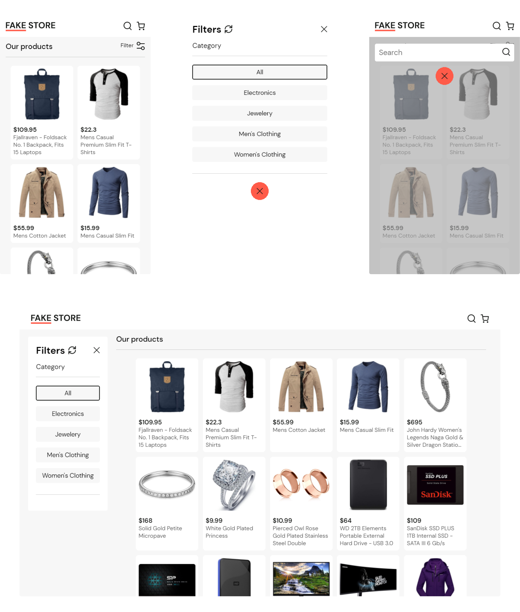
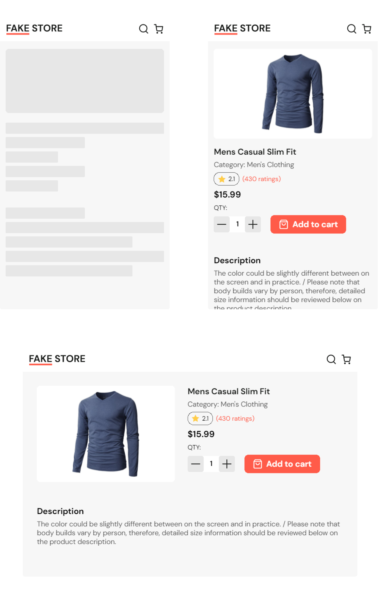

# Fake Store - Web App

Web app created with the intention of practicing the use of API's with React, in this project the API used was [Fake Store API](https://fakestoreapi.com).

The design of the entire project takes inspiration from many websites but primarily from [FOREVER 21](https://forever21.com.mx) because of its simple but organized design. :ok_hand:

## Technologies used

• HTML
• SASS
• JavaScript
• React
• Redux

#

## A preview of the project

#

**Note:**
when developing web pages I always start with the mobile version and once all its functionalities are ready, I continue with the remaining versions that would be tablet and laptop.
